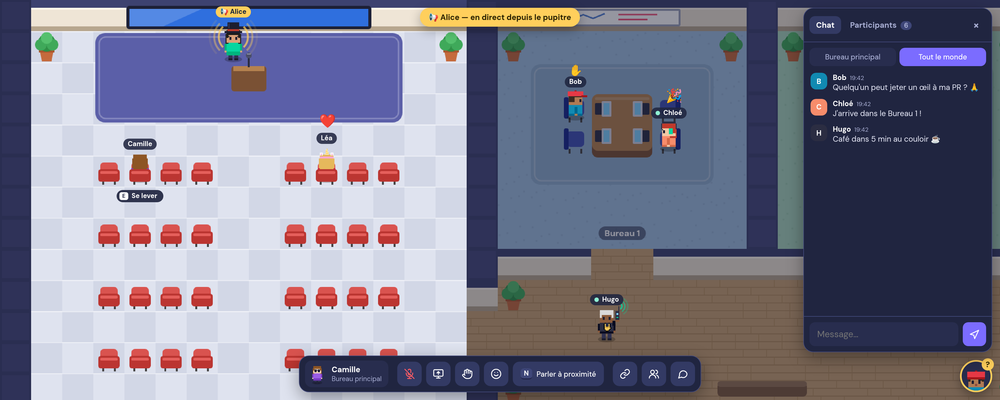

# Remote Town

Un bureau virtuel façon Gather Town, en plus simple : pas de compte, pas de serveur. L'audio, le partage d'écran et le chat passent en WebRTC pair-à-pair.

**Démo : https://c4software.github.io/remote-town/**



Choisissez une **salle** sur l'écran de connexion (ou ouvrez un lien `?room=nom`) : seules les personnes dans la même salle se retrouvent. Le bouton lien (sur l'écran de connexion et dans la barre du bas) copie le lien d'invitation, ou ouvre le partage natif sur mobile. Le nom, l'apparence et la dernière salle sont mémorisés dans le navigateur.

Fonctionne aussi sur mobile : on se déplace en touchant la carte, avec des boutons pour le dash et « parler à proximité ». Le partage d'écran n'existe pas sur les navigateurs mobiles.

## La carte

- **Bureau principal** (à gauche) : le micro (`M`) et le partage d'écran sont partagés avec les personnes présentes dans la salle. Pour parler **à tout le monde**, où que les gens soient, on se place au **pupitre** avec `E` (ou en le touchant, sur mobile) : la voix est alors diffusée à tous, avec un effet « haut-parleur » de sonorisation, et son partage d'écran apparaît chez chacun en petite fenêtre (PiP) : un clic l'agrandit. `E` à nouveau ou s'éloigner du pupitre rend la parole.
- **10 bureaux de 4 places** (table, 4 chaises) : le micro (`M`) et le partage d'écran (fonction native de Chrome) ne sont reçus que par les personnes **dans le même bureau**.
- **Salle de classe** (au bout du couloir, 32 places) : micro et partage d'écran reçus par **toute la classe**.
- **Tableau blanc** (salle de classe et bureau principal) : il s'ouvre uniquement depuis le **bureau du prof** (derrière le bureau de l'enseignant dans la classe, derrière le pupitre dans le bureau principal), avec le bouton tableau de la barre. La personne qui l'ouvre le pilote : elle seule dessine (couleurs, épaisseurs, gomme, tout effacer) et le ferme. Il s'affiche chez toutes les personnes de la pièce, y compris celles qui arrivent ensuite ; chacune peut le passer en **mode PiP** (petite fenêtre flottante, toujours à jour) tant qu'il est ouvert. Il se ferme quand le prof quitte la pièce.
- **Projection** : dans ces deux pièces, un partage d'écran s'ouvre automatiquement en grand chez les personnes présentes.
- **Couloir** : pas de partage d'écran ; on parle avec `N` (à proximité) ou, micro ouvert, aux personnes juste à côté.
- **Porte des espaces** (porte violette « ESPACES » du couloir, entre les bureaux 1 et 2, avec à sa droite un écriteau au nom de l'espace en cours) : on change d'**espace de travail** (une autre salle) sans quitter la page. On saisit l'identifiant de l'espace ou on choisit dans la liste des espaces déjà visités (mémorisée dans le navigateur, chaque entrée peut être retirée). Le personnage entre dans la porte, l'écran se referme puis se rouvre sur une petite musique de transition (entendue seulement par la personne qui passe), et il ressort de la même porte dans l'autre espace, avec le même nom et la même apparence. Le lien de la page et la salle proposée à la prochaine visite suivent. C'est aussi par cette porte qu'on arrive en rejoignant l'espace : au clic sur « Rejoindre l'espace », un cercle noir part de l'endroit cliqué et recouvre l'écran, la musique démarre, puis l'écran se rouvre sur la porte d'où sort le personnage (un pas de côté si quelqu'un s'y tient déjà).

Partout, **maintenez `N`** pour parler aux personnes à moins de 4 cases **dans la même zone** (les murs bloquent le son) ; le volume baisse avec la distance. Dans le couloir, avec le micro ouvert (`M`), les personnes **côte à côte** (cases voisines) vous entendent directement, sans `N`. Micro coupé, personne ne vous entend. Pas dans les pièces, où `M` parle à toute la pièce.

## Personnage

À la connexion, on choisit le style (gars ou fille), les couleurs du haut, des cheveux et de la peau, et deux accessoires combinables : un pour la **tête** (🧢 casquette, 🧶 bonnet, 🎩 haut-de-forme, 🥳 chapeau de fête, 👑 couronne, 🦄 licorne, 🐱 oreilles de chat, 🌸 fleur, 🎧 casque audio, 👓 lunettes de vue, 🤓 grosses lunettes, 🕶️ lunettes de soleil) et un pour le **corps** (🤘 t-shirt metal, ✳️ t-shirt Claude, ⌨️ t-shirt Codex, 🐧 t-shirt Linux, 🪟 t-shirt Windows, 🍎 t-shirt macOS, 👔 cravate, 🎀 nœud papillon, 🧣 écharpe, 🏅 médaille, 🎒 sac à dos, 🦸 cape). On peut aussi choisir son **micro** (avec un indicateur de niveau pour vérifier qu'il capte) ; en cours de session, le changement est immédiat, sans couper la conversation. Le pseudo est unique dans chaque espace, sans tenir compte des majuscules ni des espaces ou caractères invisibles : si quelqu'un le porte déjà, la personne arrivée en dernier doit en choisir un autre. Tout est mémorisé dans le navigateur. Une fois dans l'espace, un clic sur son identité (en bas à gauche, ou sur sa ligne dans la liste des participants sur mobile) rouvre cet écran pour changer de nom ou d'apparence, ou réafficher l'aide.

On s'assoit sur les chaises et sur les canapés du coin salon (`E`, ou en les touchant sur mobile). On peut traverser les autres personnages, mais une place occupée est réservée : impossible de s'y asseoir à deux.

## Chat

Un clic sur un nom, dans le chat ou dans la liste des participants, emmène auprès de la personne.

Deux onglets : **la zone où vous êtes** (seules les personnes présentes le reçoivent) et **Tout le monde**. Sans serveur, l'historique vit chez les participants : en arrivant, on le récupère auprès des personnes déjà connectées. Quand tout le monde est parti, il disparaît.

## Attente et reconnexion

Il n'y a pas d'hôte : chacun est relié directement à tous les autres, et le départ d'une personne ne coupe pas les autres. Quand on se retrouve seul, un bandeau « En attente des autres participants… » s'affiche, et on retrouve automatiquement les autres dès leur retour. Si la connexion saute (réseau, onglet en veille), l'app rejoint la salle d'elle-même ; le bandeau propose aussi d'inviter ou de relancer la connexion. Si vous restez seul·e alors que d'autres sont là, le bouton « 🩺 Diagnostic » (dans le bandeau et dans l'écran du personnage) copie un rapport sur votre connexion (navigateur, relais, liaisons, test réseau, sans adresse IP) et l'envoie à notre relais : transmettez-le à la personne qui anime l'espace.

## Commandes

| Touche | Action |
| --- | --- |
| Flèches / WASD (ZQSD en AZERTY) | Se déplacer (sur ordinateur, au clavier uniquement ; sur mobile, en touchant la carte) |
| `Maj` maintenu | Courir, dans la limite de son endurance : une jauge sous les pieds se vide en courant (~4 s) ; essoufflé·e, on ne peut plus courir avant d'avoir repris son souffle (plus vite à l'arrêt qu'en marchant) |
| `Espace` | Dash : bond de 3 cases, avec traînée |
| `E` (sur mobile : toucher une chaise / le pupitre) | S'asseoir / se lever ; au pupitre : parler à tout le monde |
| `J` (au pupitre) | Jingle d'annonce : un carillon joué chez tout le monde |
| Clic droit maintenu (appui long sur mobile) | Émote animée en boucle, choisie dans une roue : 💻 travail, ⏳ AFK, 😴 sieste, ☕ café, 🤔 réflexion. Se déplacer la retire, le centre de la roue aussi |
| `E` devant la porte violette du couloir (sur mobile : la toucher) | Changer d'espace de travail : saisir un identifiant ou choisir un espace enregistré. On passe la porte et on ressort dans l'autre espace, avec le même personnage |
| `C` | S'accroupir / se relever (on avance à pas de loup) |
| `V` | Sauter |
| `B` maintenu | Dab (vu par tout le monde) |
| `1` … `6` (ou bouton 🙂) | Réactions 👍 ❤️ 😂 🎉 👏 😮 au-dessus du personnage |
| `H` (ou bouton ✋ de la barre) | Lever / baisser la main (✋ reste affichée). Les mains levées apparaissent en bulles en bas à droite : un clic propose de rejoindre la personne ou de l'appeler au téléphone |
| `N` maintenu | Talkie-walkie : parler à proximité (bips d'ouverture et de fin entendus de soi seul, une seule fois en cas d'appuis répétés ; personnage qui lève son talkie). Indisponible dans la salle de classe et le bureau principal |
| `M` | Couper ou ouvrir le micro |
| Clic droit sur une personne de la liste des participants (appui long sur mobile) | Régler son volume pour soi (curseur, ou couper) ; mémorisé, rappelé par un badge « 🔉 40 % » dans la liste |
| Même menu → « 📞 Appeler … » | Téléphone : appeler une personne où qu'elle soit dans l'espace. Un petit téléphone apparaît en bas de l'écran et ça sonne des deux côtés (20 s) ; une fois décroché, on s'entend jusqu'à ce que l'un raccroche. Sans réponse (ou refus, ou personne occupée), on peut laisser un message vocal de 20 s. Pas d'appels à la suite (30 s d'attente), et pas de téléphone dans la salle de classe ni le bureau principal |
| `Entrée` / `Échap` | Écrire dans le chat / quitter le champ |
| `P` | Vue en incrustation (Chrome / Edge sur ordinateur) : une petite fenêtre, par-dessus les autres, qui montre les alentours de son personnage pour voir qui s'approche. Elle peut aussi s'ouvrir toute seule en changeant d'onglet (à activer dans l'écran du personnage) |

## Comment ça marche

- La mise en relation WebRTC passe par un relais [Nostr](https://nostr.com) grâce à [Trystero](https://github.com/dmotz/trystero) (embarqué dans `public/vendor/`) : le nôtre (dossier `relay/`, sans quota par adresse IP, pour les salles pleines derrière un même réseau), avec des relais publics en secours. Les relais ne voient que les messages de mise en relation (chiffrés), jamais l'audio, la vidéo ou le chat.
- Chaque participant est connecté à tous les autres (maillage). Ça tient pour quelques dizaines de personnes.
- Pour chaque pair, on envoie une copie de son micro et de son écran, activée ou coupée selon les règles de zone (`public/js/world.js`). Il n'y a pas de renégociation, donc `N` répond tout de suite.
- Les règles sont appliquées par le navigateur de chacun : c'est fait pour une équipe de confiance, pas pour un espace public.
- Pour trouver son adresse publique, l'app s'appuie sur des serveurs STUN gratuits (Google, Cloudflare). Derrière certains réseaux d'entreprise (NAT strict), un serveur TURN est nécessaire : l'app en demande au relais (`/turn`) et s'en passe s'il n'en fournit pas. Dans la liste des participants, un badge « relais » signale une liaison qui passe par TURN.

## Développement

```bash
npm start          # http://localhost:3000 (serveur statique, aucune dépendance)
npm run check      # vérifie la syntaxe de tous les modules
npm test           # tests unitaires des règles du monde (Node, sans dépendance)
npm install        # une fois, pour les tests de bout en bout (puppeteer-core)
npm run test:e2e   # scénarios à plusieurs navigateurs Chrome (nécessite Chrome et Internet)
npm run test:e2e -- pupitre   # un seul scénario
```

En local (`localhost`, serveur de développement) ou avec le jeton d'administration, ouvrir la page avec `?debug` expose `window.rt` dans la console (participants, position, `rt.walkTo(x, y)`, `rt.place(x, y)`, `rt.relaunch()`…), utilisé par les tests de bout en bout.

Le déploiement sur GitHub Pages se fait automatiquement à chaque push sur `main` (`.github/workflows/pages.yml`) : vérification de la syntaxe, tests unitaires, puis publication du dossier `public/`.

## Structure

```
public/
  index.html, style.css
  vendor/trystero-nostr.js   Trystero 0.25.4 (licence MIT), réseau pair-à-pair
  js/
    main.js        point d'entrée : branche les modules, accès ?debug
    state.js       état partagé (S, users, keys, myIds)
    config.js      constantes (vitesses, palettes, relais, STUN, clavier)
    diag.js        rapport sur la connexion, copié et envoyé au relais (/diag dans le chat)
    world.js       carte, zones, règles « qui entend / voit qui » (module pur)
    dom.js         utilitaires d'interface ($, toast…)
    avatar.js      dessin des personnages et accessoires
    map-render.js  dessin de la carte
    render.js      boucle et rendu de la scène
    movement.js    déplacements, chaises, pupitre, dash, rejoindre quelqu'un
    input.js       clavier et souris
    net.js         connexion, messages reçus, présence, reconnexion
    media.js       flux micro / écran par pair, micro, N, partage
    audio.js       micro, niveaux, bips, effet haut-parleur
    profile.js     écran du personnage
    rooms.js       salles et liens d'invitation
    hud.js         démarrage, changement de zone, barre du bas, aide
    panel.js       panneau latéral et participants
    chat.js        chat de zone et global
    social.js      réactions, main levée, bulles
    phone.js       téléphone entre deux personnes, messages vocaux
    board.js       tableau blanc
    videos.js      partages d'écran reçus, projection
relay/             relais de mise en relation auto-hébergé (Node, Docker)
tests/
  world.test.js    tests unitaires (npm test)
  e2e/             tests de bout en bout (npm run test:e2e)
server.js          serveur statique de développement
AGENTS.md          guide pour faire évoluer le projet
```
